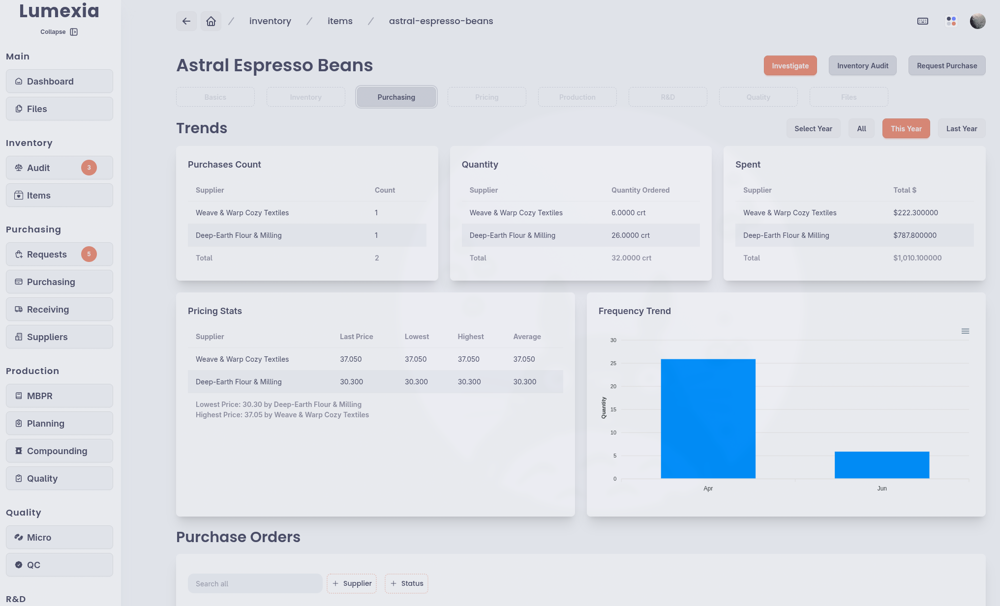

# Lumexia · Manufacturing ERP

**[Live Demo](https://lumexia-demo.isaacvargas.dev) · [Documentation](./docs)**

Lumexia is a manufacturing, quality, and inventory management system that helps a
production business run smoothly from end to end. It brings procurement,
inventory, production, quality, pricing, and research & development into one
place so the business stays organized, traceable, and in control.

> **Note:** Lumexia is under active development and is an ongoing work in
> progress. It has also been my medium for learning different technologies and
> orchestrating them into a specific vision.

## What it does

- **Inventory.** Tracks every item and material stock through lot numbers,
  multiple inventory quantities, label generation and scanning, inventory
  audits, and reconciliation of discrepancies.
- **Procurement & purchasing.** Manages the full purchase cycle, from raising
  procurement requests to issuing purchase orders and receiving deliveries.
- **Production.** Holds master batch records that are instantiated as batch
  production records, with a compounding workflow that guides batches through
  step-by-step instructions, quality checks, and full traceability back to the
  exact lots of materials used.
- **Quality.** Covers quality testing throughout the production cycle.
- **Pricing & accounting.** Handles parametric pricing and costing of produced
  formulations and purchased items with an approval workflow, plus accounting
  reconciliation with payment methods.
- **Research & development.** Provides an electronic laboratory notebook,
  including laboratory sample label generation.

## Motivation

This project grew out of my work as a formulations and analytical chemist for a
white-label cosmetic and bath product manufacturer. The company had brilliant
formulations and chemists but few digital solutions; most workflows lived in
physical paper trails, unorganized spreadsheets, or the memory of specific
employees. That became untenable during the COVID pandemic, when we shifted to
producing and shipping hand sanitizer at enormous volume and procurement turned
chaotic. I was learning JavaScript at the time and started building tools to
help, and Lumexia grew from there.

## Tech stack

Next.js · TypeScript · PostgreSQL · Prisma · RustFS · Docker

## Similar projects

Lumexia is not the first inventory or manufacturing management software. If its
choices or its cosmetic-manufacturing bias are not for you, these are worth a
look:

- [Odoo](https://www.odoo.com)
- [Dozuki](https://www.dozuki.com)
- [BatchMaster](https://www.batchmaster.com)
- [SciNote ELN](https://www.scinote.net/product/)
- [Homebox](https://homebox.software/en/) (home inventory, an excellent
  open-source project)

